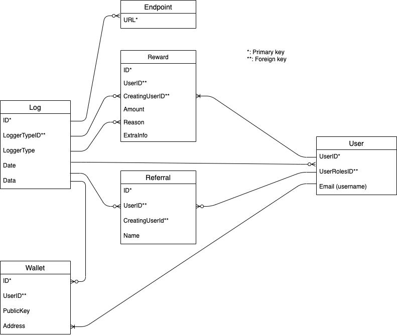

# Incentive Cash

This document describes the requirements for the incentive cash system.

## Functional Requirements

Below describes the basic functioning of the incentive mechanism.

### The Incentive System

The incentive system (IS) should, where possible, be automated:

1. Admin assigns incentive tokens (IT) to _Bob_ via records in the incentive database (ID)
2. _Bob_ logs into the incentive system (IS), and downloads and installs the incentive MiniDapp (IM)
3. _Bob_ opens IM, whereupon it creates a Minima transaction on IS (somehow), which updates IM with the IT allocated to _Bob_
4. At _x_ specified date (how?), a background process running within IM sends _y_ amount of tokens to a _null address_ (burning the tokens)
5. A process running on IS is monitoring that _null address_, so it sees that _Bob_ has sent _y_ tokens to the _null address_ and updates the ID accordingly (which means that _Bob_ will be due the requisite amount Minima at Mainnet launch)

### Roles

**Users** should be able to sign up and login to a service (possibly using a referral code), where they can download an incentive MiniDapp, and afterwards, claim their _assigned_ IT simply by running Minima. They should also be able to see and modify their profile and see a summary of their IT amounts and a log of stuff they've done. They should be able to distribute any referral codes that they've been assigned.

**Incentive Admins** (Minima staff) should be able to assign IT to users for _xyz_ reason. They should also be able to assign referral codes to users. They can browse all ID information, which could include, "How many users do we have?", "How many incentive tokens have we distributed?", "How many users are logged in?" etc. In other words, _stats_, _stats_ and more _STATS_!

**System Admins** should be able to manage all ID tables, create and delete users, plus all the **Incentive Admins** tasks.

## IS Requirements

To meet the [functional requirements](#functional-requirements), above, IS should implement the following:

### ID

The incentive database will be [MySQL](https://www.mysql.com/), fronted up by the headless CMS [directus](https://directus.io/), which gives "an instant app and API for your SQL database" (their words).

#### ID Design

### User Service

A web-based front end service (allowing users to login to the ID, download the minidapp and claim (and view) their tokens) will be a javascript single-page application. Minima will have to build that, using _React_ and the directus API.

### Admin' Service

Directus comes with a pre-packaged admin' app' that we can use to assign different user roles etc.

### MiniDapp

IM is to be a version of FutureCash, plus a background process capable of sending _y_ amount of tokens on _x_ date from a user _z_ to a _null address_.

### Server-side Minima Processes

There will be two server-side processes:

1. The IS will include a server-side MiniDapp that will use the directus javascript API and _minima.js_ to monitor the _null address_ to which IM sends its tokens, and once it sees tokens sent to that address, it will find the ID of the user who sent those tokens and update the ID accordingly.

2. When a user first opens IM, a call will be made to another server-side MiniDapp that sends the user their IT. In so doing, it will create a Minima transaction and modify ID accordingly.

### Referral System Design

The referral system should take into account user AND medium (twitter etc.). We must be able to limit the amount of referrers (i.e. 10 referrer credits) per user.
